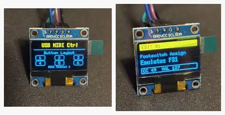

# KB2040 USB and DIN MIDI Controller for Line 6 HX Stomp

Firmware for a six-switch USB and DIN MIDI stompbox controller for the Line 6
HX Stomp, built around an Adafruit KB2040. The controller sends MIDI CC
messages for six stomp switches, shows status on a 128x64 SSD1306 OLED, and
includes an onboard edit mode for changing each switch's HX Stomp assignment
without reflashing the firmware.

The controller supports two MIDI outputs with different intended uses. Use the
5-pin DIN MIDI output to control the HX Stomp directly. Use USB MIDI when
connecting the KB2040 to a USB host, such as a computer.

<p align="center">
  
</p>

> **Work in progress:** this project is currently a work in progress. 3D print
> files for a case will be added as the enclosure design matures.

## Board Target

- Board: Adafruit KB2040
- Firmware framework: Arduino sketch using the Raspberry Pi Pico/RP2040/RP2350
  core by Earle F. Philhower, III
- FQBN: `rp2040:rp2040:adafruit_kb2040:usbstack=tinyusb`
- USB stack: Adafruit TinyUSB
- DIN MIDI output: KB2040 `D0` / GPIO0 / UART TX at `31250` baud

This is a KB2040/RP2040 project, not an Arduino-branded board. The firmware is
written as an Arduino `.ino` sketch and built with Arduino IDE or Arduino CLI
through the Philhower RP2040 board core.

The sketch pin numbers match the KB2040's RP2040 GPIO numbers for the digital
pins used here. For example, sketch pin `4` is GPIO4 / the board pad labeled
`D4`, not an AVR Pro Micro pin remap.

## Behavior

- MIDI channel: `1`
- USB MIDI is available for USB hosts such as computers.
- The HX Stomp does not act as a USB host for this controller, so direct HX
  Stomp control should use the 5-pin DIN MIDI output.
- Press debounce: `25 ms`
- Edit mode hold: `4 seconds`
- Pressing a stomp switch with a fixed-value assignment sends one MIDI Control
  Change message over both USB MIDI and DIN MIDI output.
- The last-button display returns to the home screen after `5 seconds`.
- Holding a stomp switch enters edit mode for that switch after the initial
  normal MIDI message.
- Pressing the same stomp switch while editing exits edit mode.
- Previous/next edit buttons scroll the HX Stomp preset list.
- The preset list includes HX Stomp expression pedal CC entries for EP1 and EP2
  as variable `0-127` values; those are preserved as analog-value entries, not
  emitted as fixed stomp-switch values.
- Expression pedal 1 is read on `A1` and sent as MIDI `CC 1` with smoothed
  variable values from `0-127` over both USB MIDI and DIN MIDI output.
- Expression pedal position is shown as a persistent right-side slider on the
  OLED instead of replacing the current screen.
- Edited assignments are saved using the RP2040 core's flash-backed
  `EEPROM.h` emulation.

## Button Wiring

Wire each button between the listed KB2040 board pad and `GND`. The firmware uses
`INPUT_PULLUP`, so a pressed button reads `LOW`.

| Button | KB2040 Board Pad / GPIO / Sketch Pin | Default MIDI CC | Press Value |
| --- | ---: | ---: | ---: |
| 1 | D4 / GPIO4 / `4` | 69 | 0 |
| 2 | D5 / GPIO5 / `5` | 69 | 1 |
| 3 | D6 / GPIO6 / `6` | 69 | 2 |
| 4 | D7 / GPIO7 / `7` | 52 | 127 |
| 5 | D8 / GPIO8 / `8` | 53 | 127 |
| 6 | D9 / GPIO9 / `9` | 25 | 127 |

## Edit Buttons

| Edit Control | KB2040 Board Pad / GPIO / Sketch Pin | Behavior |
| --- | ---: | --- |
| Previous | D10 / GPIO10 / `10` | Previous assignable preset |
| Next | A0 / GPIO26 / `A0` | Next assignable preset |

## Expression Pedal Wiring

Expression pedal 1 uses a 1/4" mono TS jack for a Line 6-style passive
expression pedal such as the Mission EP1-L6.

| Jack / Part | KB2040 Connection |
| --- | --- |
| Sleeve | `GND` |
| Tip | `A1` |
| Pull-up resistor | Between `A1` and `3V` |

The current test build uses a `5.1k` pull-up resistor. The sketch calibrates the
observed analog range with `EXPRESSION_RAW_MIN` and `EXPRESSION_RAW_MAX`, clamps
near-endpoint values to clean `0` and `127`, and uses `EXPRESSION_MIDI_DEADBAND`
to avoid sending MIDI for one-step analog jitter. If the pedal direction is
backwards, set `EXPRESSION_INVERT` to `true` in the sketch and reflash.

## DIN MIDI Output Wiring

The DIN MIDI output mirrors the USB MIDI messages and is the intended connection
for the HX Stomp. This avoids the USB host limitation: the KB2040 presents
itself as a USB MIDI device, and the HX Stomp's USB port does not host that
device directly.

| DIN-5 MIDI Out Jack | KB2040 Connection |
| --- | --- |
| Pin 4 | `3V` through a `30 ohm` or `33 ohm` resistor |
| Pin 5 | `D0` through a `10 ohm` resistor |
| Pin 2 | `GND` / shield |
| Pins 1 and 3 | Not connected |

Be careful with DIN jack pin numbering: front view and solder-lug view are
mirrored. Verify pins with the connector datasheet or a continuity check before
soldering.

## Display Wiring

The sketch uses `Wire1`, the KB2040's secondary I2C bus on visible edge pins:

| I2C Signal | KB2040 Pin |
| --- | --- |
| SDA | D2 |
| SCL | D3 |

Use a 128x64 monochrome SSD1306 I2C display. The firmware uses U8g2 full-buffer
graphics mode for pixel-positioned text, frames, and inverse headers.

## Build

Install the Philhower RP2040 board package URL in Arduino IDE / Arduino CLI:

```text
https://github.com/earlephilhower/arduino-pico/releases/download/global/package_rp2040_index.json
```

Then compile with:

```powershell
powershell -ExecutionPolicy Bypass -File scripts/build.ps1
```

Equivalent Arduino CLI command:

```powershell
arduino-cli compile --fqbn rp2040:rp2040:adafruit_kb2040:usbstack=tinyusb KB2040MIDIController
```

In Arduino IDE, select **Adafruit KB2040** and set **Tools > USB Stack** to
**Adafruit TinyUSB**.

## Startup Screen

```text
USB MIDI Ctrl

Button Layout

1  2  3
4  5  6

MIDI Channel: 1
```
